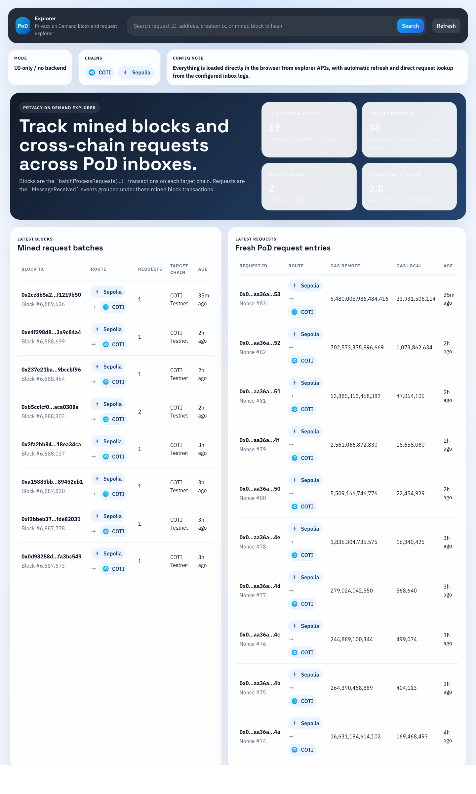
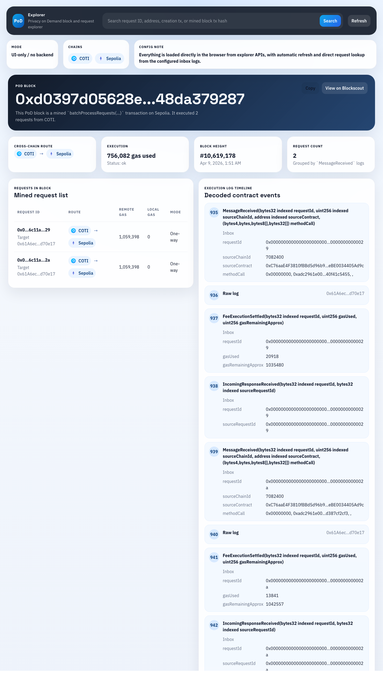
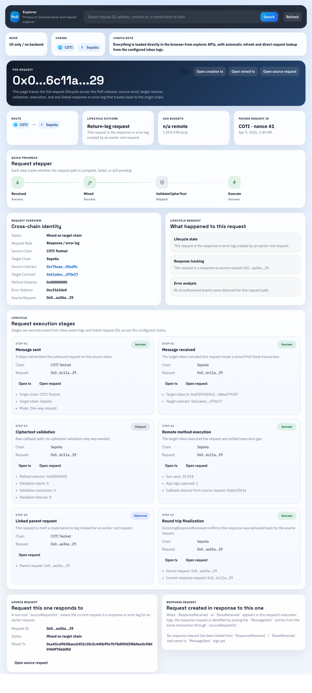
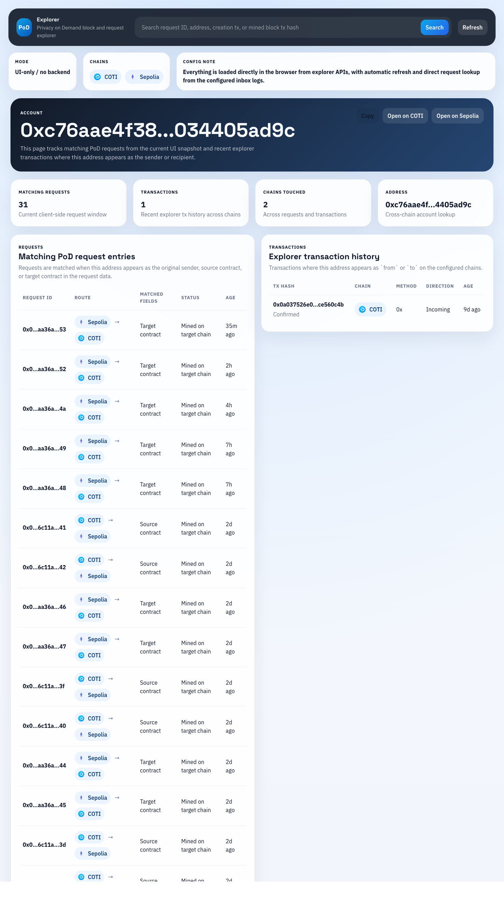

# PoD Explorer Tutorial

This folder contains a quick walkthrough for the PoD explorer UI and a set of populated screenshots captured from the live app.

Important note: this explorer loads data directly in the browser from explorer APIs and RPC calls. After opening any page, wait a few seconds for the data to populate. If you want an immediate refresh, use the `Refresh` button in the top bar.

## Screenshot previews

Scaled previews below; open the PNG in this folder (or click an image on GitHub) for the full-resolution capture.

| [Home](./home.png) | [Block](./block-page.png) |
|:-:|:-:|
|  |  |

| [Request](./request-page.png) | [Account](./account-page.png) |
|:-:|:-:|
|  |  |

**Files in this folder:** `home.png`, `block-page.png`, `request-page.png`, `account-page.png`

## Walkthrough

Use this sequence the first time you open the explorer, or when showing someone else around the UI.

1. **Land on home** (`#/`) and wait for `Latest blocks` and `Latest requests` to fill in, or press **Refresh** in the top bar if lists look empty.
2. **Orient on the home page:** note chain configuration, scan recent blocks and requests, and locate the global search field.
3. **Choose how to drill in:**
   - You have a **request ID** → search it, or click the matching row under **Latest requests**.
   - You have a **mined transaction hash** → search it to open the block (or a related request when the app can resolve it).
   - You only have an **address** (wallet or contract) → search it to open the account view.
4. **Request page:** confirm the route (source → target), read the stepper for a fast health summary, then use **Open creation tx** / **Open mined tx** and **Request execution stages** for detail. For two-way flows, follow the linked response request when it appears.
5. **Block page:** confirm the chain and transaction hash, check how many requests were batched, then use **Requests in block** and the decoded log timeline for execution order.
6. **Account page:** compare the request list with the transaction list to see how the address participates (sender, recipient, or contract context).
7. **Next steps:** for a structured debugging order, use [Recommended Debugging Workflow](#6-recommended-debugging-workflow) and [Search Guide](#5-search-guide) below.

Example routes used for the screenshots are listed at the end under [Example Routes Used For This Tutorial](#example-routes-used-for-this-tutorial).

## 1. Home Page

The home page is the command center for the explorer. It shows:

- latest mined PoD blocks
- latest PoD request entries
- top-level chain configuration
- the global search box

### What to look at here

- `Latest blocks`: each row is a mined PoD batch transaction on a target chain.
- `Latest requests`: each row is a PoD request, with route, gas figures, and age.
- Search bar: accepts a request ID, transaction hash, or address.

### Typical use

- Click a block to inspect a mined batch.
- Click a request to inspect its lifecycle.
- Search a request ID when debugging a single cross-chain flow.
- Search an address to inspect all related requests and transactions.

## 2. Block Page

The block page is how you inspect one mined PoD transaction in detail.

### What this page tells you

- which chain mined the batch
- how many requests were grouped into the transaction
- total execution gas usage
- decoded execution logs from the mined transaction
- the list of requests included in the batch

### How to read a block page

1. Start with the header and confirm the transaction hash and target chain.
2. Check the request count so you know whether the batch contains one request or several.
3. Read the `Requests in block` list to find the request ID you care about.
4. Use the decoded log timeline to inspect the exact execution sequence:
   - `MessageReceived`
   - validation-related events
   - execution settlement
   - error or response events

### When this page is most useful

- when a request has definitely been mined
- when multiple requests were mined together
- when you want the raw target-chain execution timeline

## 3. Request Page

The request page is the heart of the explorer. It reconstructs the lifecycle of one request and, when relevant, its response leg.

### What this page shows

- the request route: source chain to target chain
- creation transaction
- mined transaction
- request stepper
- request execution stages
- response or round-trip sections
- raw request fields
- decoded target-chain logs

### How to read a request page

1. Confirm the request ID in the header.
2. Check the route chips to verify source chain and target chain.
3. Use `Open creation tx` to inspect where the request was created.
4. Use `Open mined tx` to inspect the transaction that executed the request on the target chain.
5. Read the horizontal stepper for a fast health summary.
6. Read `Request execution stages` for exact lifecycle details.
7. If the request is two-way, inspect the response section and follow the linked response request.

### How to interpret the stepper

- `Received`: the explorer found the request record and source-side creation context.
- `Mined`: the target-chain `MessageReceived` mining transaction was found.
- `ValidateCipherText`: may be `success`, `failed`, or `skipped`.
- `Execute`: shows whether remote execution succeeded or failed.
- `Response Mined`: for two-way requests, shows whether the return leg was mined.
- `Response Executed`: for two-way requests, shows whether the response leg executed successfully.

### Debugging with the request page

- If `Mined` is still pending, the request was created but not yet executed on the target chain.
- If `ValidateCipherText` failed, inspect the decoded logs and error details first.
- If `Execute` failed, inspect the request error panel and the mined transaction logs.
- If the request is two-way and the first execution succeeded, check whether the response was generated and mined.
- If a response exists, open the response request page and debug it as a separate request leg.

## 4. Account Page

The account page is a cross-checking page for a wallet or contract address.

### What this page shows

- requests where the address appears in request fields
- explorer transactions where the address is the sender or recipient

### How to use it

- Search a wallet address to find all requests related to a user or dApp.
- Search an inbox or app contract to see requests tied to that contract.
- Compare the request list with the transaction list to understand whether the address initiated, received, or participated in the flow.

## 5. Search Guide

The global search bar supports three useful inputs:

- `Request ID`: opens the request page.
- `Transaction hash`: opens the relevant block page or resolves to the related request when possible.
- `Address`: opens the account page.

### Good search workflow

1. If you already know the request ID, search it directly.
2. If you only know a mined transaction hash, search the tx first, then click into the request from the block page.
3. If you only know the sender, receiver, or contract, search the address and work inward from the account page.

## 6. Recommended Debugging Workflow

Use this order when diagnosing PoD issues:

1. Search the request ID.
2. On the request page, confirm the source chain, target chain, contracts, and current status.
3. Open the creation transaction to confirm the request was created with the expected route and calldata.
4. Open the mined transaction to inspect the target-chain execution logs.
5. Check whether execution failed, succeeded without response, or succeeded with a response leg.
6. If there is a response request, open it and debug the return leg exactly the same way.
7. If you only know an address, start from the account page and then pivot into the relevant request or transaction.

## 7. Practical Notes

- The explorer is UI-only. There is no backend indexer behind it.
- Background refresh runs periodically, but `Refresh` forces an immediate reload.
- Some pages may take a few seconds to populate because data is assembled from multiple chains and explorer endpoints.
- External links on the page open the correct chain explorer for that chain.

## Example Routes Used For This Tutorial

These were the live examples used for the screenshots:

- Home page: `#/`
- Block page: `#/block/sepolia/0xd0397d05628efeddcb4a18e692c3c264474c830c9eaaa4494dab1348da379287`
- Request page: `#/request/sepolia/0x000000000000000000000000006c11a000000000000000000000000000000029`
- Account page: `#/account/0xc76aae4f3810fbbd5d96b92defebe0034405ad9c`
